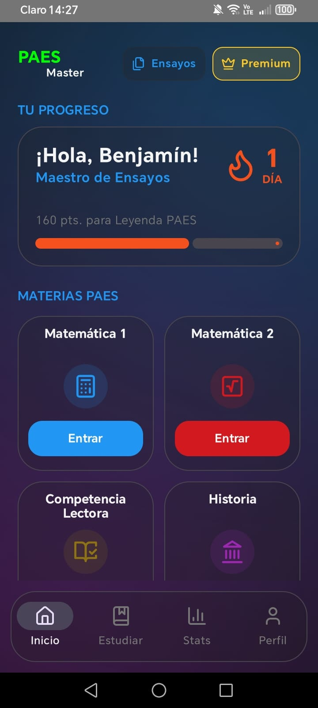
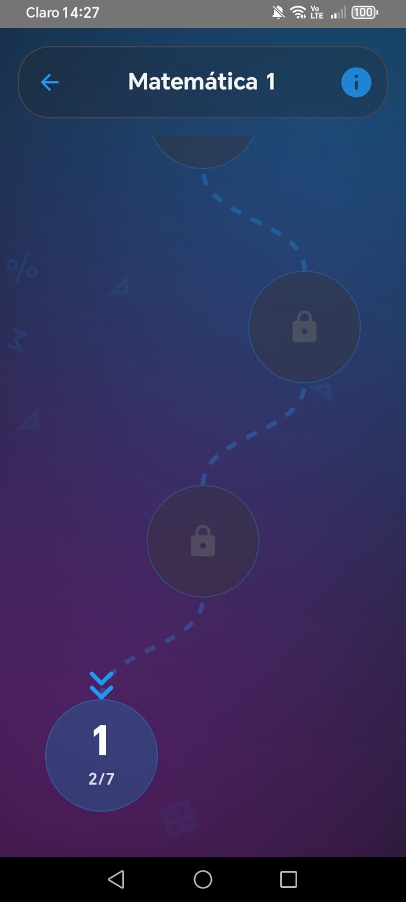
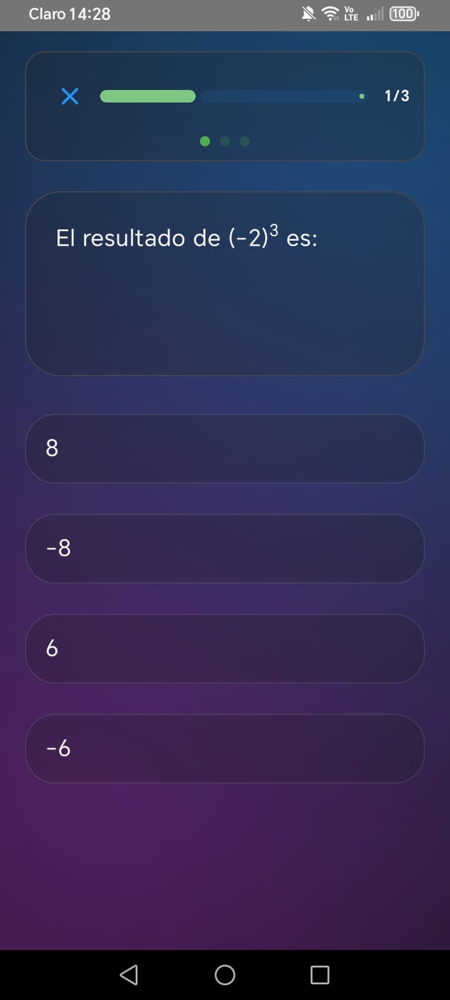
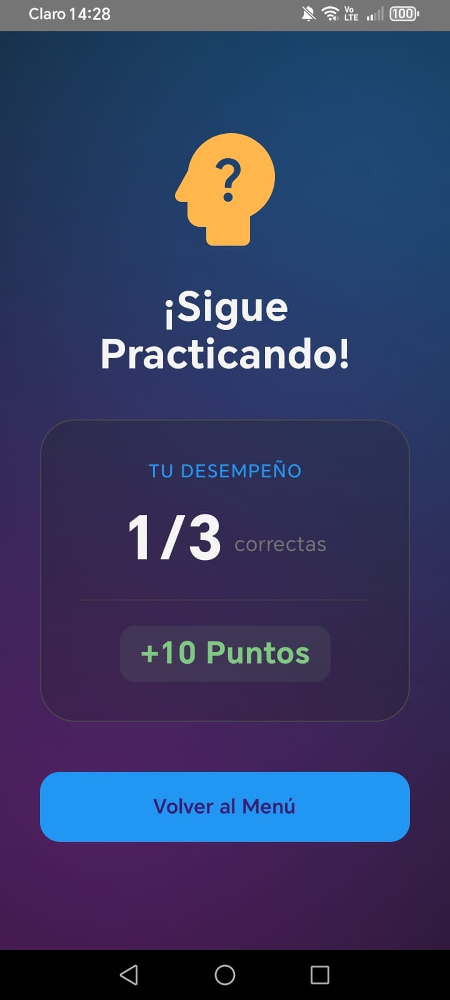

# ¡Hola! Soy DopaDC 👋

### Desarrollador Android en formación 📱

Actualmente enfocado en el desarrollo de aplicaciones nativas para Android. Mi objetivo es dar soluciones a problemas de la vida real mediante la creación de apps, apostando por el aprendizaje continuo y la innovación tecnológica.

---

### 🛠️ Stack Tecnológico Android

* 🧠 **Lenguaje:** Kotlin
* 🎨 **UI:** Jetpack Compose
* 💻 **IDE:** Android Studio
* 🏗️ **Arquitectura:** MVVM & Clean Architecture
* 💉 **Inyección de Dependencias:** Hilt & Koin 
* 🧪 **Testing:** Unit Testing con JUnit & Mockk 
* 📚 **Librerías:** Coroutines, Retrofit, Room

### 🔥 Firebase Service
* 🔑 **Auth:** Firebase Authentication
* 📦 **Database:** Cloud Firestore & Realtime Database
* ☁️ **Cloud Services:** Cloud Messaging (FCM) & Storage
  
---

### 🚀 Especialización Técnica

---

---

> *"La tecnología es mejor cuando une a la gente."*

---

# PAES Master 🎓📱

**PAES Master** es una plataforma educativa gamificada diseñada para estudiantes en Chile que se preparan para las pruebas de acceso a la educación superior. La aplicación combina una experiencia de usuario altamente personalizada con una arquitectura técnica robusta y moderna.

---

## 🚀 Key Features (Valor para el usuario)

* **Estrategia de Aprendizaje:** Contenido segmentado por niveles en Matemáticas, Lenguaje, Ciencias e Historia.
* **Sistema de Gamificación:** Implementación de lógica de rangos (Aspirante a Leyenda), puntos de experiencia y gestión de rachas diarias.
* **Feedback Inmediato:** Sistema de corrección con explicaciones detalladas para fomentar el aprendizaje por error.
* **Personalización Dinámica:** Sistema de temas visuales ("Glass" y "Chocolate") que transforma la experiencia de usuario.

---

## 🛠️ Stack Tecnológico & Arquitectura

El proyecto está construido bajo estándares de la industria para garantizar escalabilidad y mantenimiento:

* **Lenguaje:** Kotlin + Jetpack Compose (100%).
* **Arquitectura:** **MVVM (Model-View-ViewModel)**, garantizando una separación clara entre la lógica de negocio y la UI.
* **Backend (Firebase):** * **Auth:** Gestión de identidad con Google Sign-In.
  * **Cloud Firestore:** Sincronización en tiempo real de progresos, perfiles y banco de preguntas.
* **Persistencia Local:** **Jetpack DataStore** para la gestión eficiente de preferencias de usuario y estados de configuración.
* **Navegación:** Type-safe navigation mediante **Navigation Compose** con paso dinámico de argumentos entre módulos.

---

## 🎨 Sistema de Diseño (UI/UX Avanzada)

Lo que hace único a este proyecto es su motor estético personalizado:

* **AppAesthetic System:** Implementación de un sistema de temas desacoplado mediante `CompositionLocal`. Esto permite que todos los componentes (UI Kit propio) reaccionen dinámicamente a cambios de transparencia, radios de bordes y paletas de color.
* **Gráficos & Performance:** * Uso de **Canvas API** para degradados atmosféricos multi-parada (evitando efectos de banding).
  * Sistema de partículas animadas optimizado para mantener una alta tasa de refresco (60fps+) sin comprometer el rendimiento del dispositivo.

---

  
  
  
  

---
> *Nota: Este repositorio es privado. Si eres un reclutador y deseas ver el código o una demo en vivo, no dudes en contactarme.*
